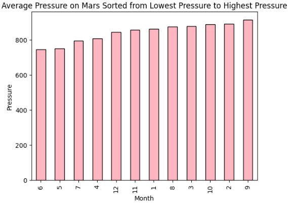
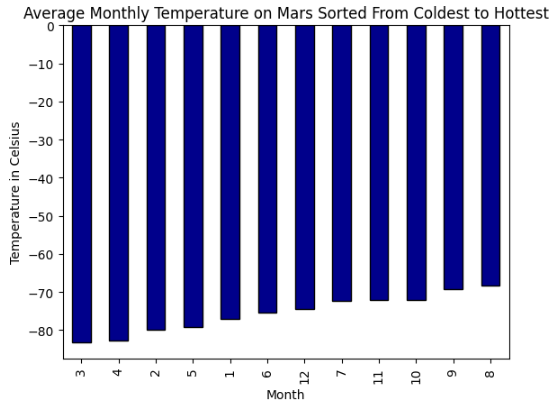
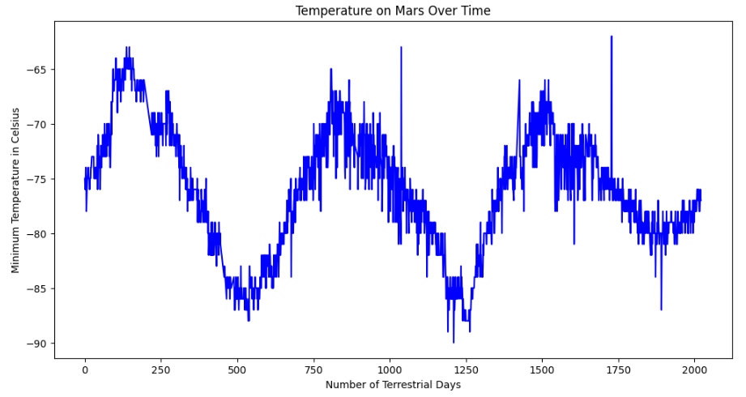

# Scraping Mars News and Weather Data

Presented by Melissa Morales

# Reference Dataset
[Mars News Site](https://static.bc-edx.com/data/web/mars_news/index.html)
[Mars Temperature Data](https://static.bc-edx.com/data/web/mars_facts/temperature.html)

# Overview

I am undertaking an advanced web-scraping and data analysis project that leverages my expertise in identifying HTML elements and extracting data using Splinter and Beautiful Soup. 

This project involves two primary tasks: 
  ** First, I will scrape titles and preview texts from Mars news articles**
  ** Second, I will extract and analyze Mars weather data from a structured table**
  
This challenge is designed to enhance my proficiency in data collection, organization, analysis, and visualization, providing a valuable opportunity to refine and apply my skills in real-world scenarios.

**Atmospheric pressure is, on average, lowest in the sixth month and highest in the ninth.**

**On average, the third month has the coldest minimum temperature on Mars, and the eighth month is the warmest.**

**The distance from peak to peak is roughly 1425-750, or 675 days. A year on Mars appears to be about 675 days from the plot. Internet search confirms that a Mars year is equivalent to 687 earth days.**
